## Module 18 - Neural Network Challenge 1
#### Due Sept 11, 2024
Carolyn Scheese

### Acknoweldgements
I used Google Colab's AI -Tool to create much of the code within this project (see comments within the code). I found the code to be about 90% correct. I also had a tutoring session which helped me correct some code. Finially, I attended after class office hours and my instructor, Bill 
was able to identify and help me correct the final piece of code that needed to be fixed. 

### Background and Purpose 
You work at a company that specializes in student loan refinancing. If the company can predict whether a borrower will repay their loan, it can provide a more accurate interest rate for the borrower. Your team has asked you to create a model to predict student loan repayment.

The business team has given you a CSV file that contains information about previous student loan recipients. With your knowledge of machine learning and neural networks, you decide to use the features in the provided dataset to create a model that will predict the likelihood that an applicant will repay their student loans. The CSV file contains information about these students, such as their credit ranking.

### Files 
https://static.bc-edx.com/ai/ail-v-1-0/m18/lms/datasets/student-loans.csv \
student_loans_with_deep_learning.ipynb from Module 18

## Import
- import pandas as pd
- import tensorflow as tf
- from tensorflow.keras.layers import Dense
- from tensorflow.keras.models import Sequential
- from sklearn.model_selection import train_test_split
- from sklearn.preprocessing import StandardScaler
- from sklearn.metrics import classification_report
- from pathlib import Path

### Before you Begin 
- Create a new repository in GitHub called _`neural-network-challenge-1`_
- Add the starter file _student_loans_with_deep_learning.ipynb_ from Module 18
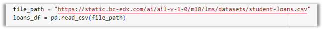

### Note
>Although you can use other tools, it is highly recommended you use Google Colab to complete this assignment. Some computers and environments have challenges with tensorflow and tensorflow.keras

### Instructions 
This challenge consists of the following steps:
#### Step 1. Prepare the data for use on a neural network model.
create features (X) and target (y) data sets
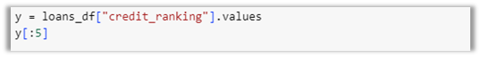

define features set X. Drop "credit_ranking"
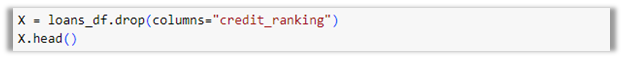 

split into training and testing data sets
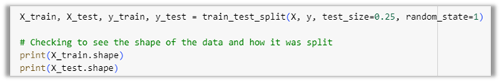

scale, fit, and transform data
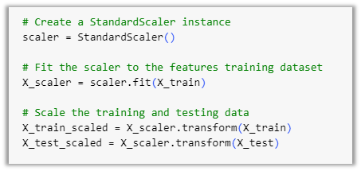

#### Step 2. Compile and evaluate a model using a neural network.
define the number of inputs (features)
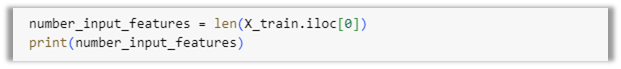

define hidden nodes and neurons
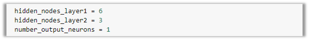

create Sequential model instance
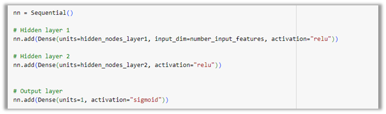

Compile and fit the model using `binary_crossentropy` loss function and `accuracy` evaluation metric
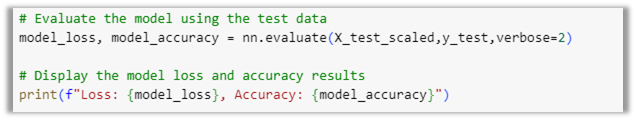

fit the model
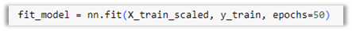

evaluate the model using test data using loss & accuracy

save and export your model as a keras file
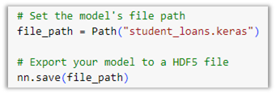

#### Step 3. Predict loan repayment success by using your neural network model.

reload saved keras model 
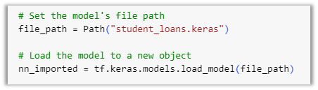

Make predictions on the testing data
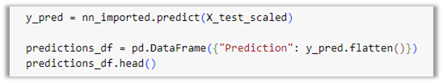

save predictions to a DataFrame. Round predictions
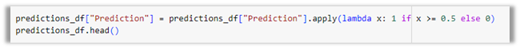

display classification report with y test and predictions
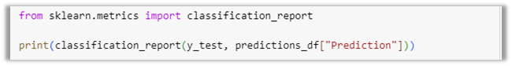

#### Step 4. Discuss creating a recommendation system for loans 
